# Guia da equipe — como usar a Telemetria da Mauá Racing Baja

Este guia é para quem vai **usar** o app: pilotos, pessoal de suspensão, trem de força,
CVT, dinâmica e quem apresenta o projeto. O detalhe técnico de cada página está em
[`ARQUITETURA.md`](ARQUITETURA.md) (seção 4).

**O jeito principal de usar é o atalho "Telemetria · Mauá Racing Baja"** na área de
trabalho: um clique e o app abre numa janela própria, com os logs guardados numa pasta
deste computador, sem conta, sem login e sem internet. Como criar o atalho:
[`NO-MEU-PC.md`](NO-MEU-PC.md). Os outros jeitos — o endereço fixo no navegador (sem
servidor) e o servidor da equipe ([`IMPLANTACAO.md`](IMPLANTACAO.md)) — continuam
valendo como alternativas ([seção 2](#2-primeiros-passos)).

As capturas de tela são da **sessão de exemplo** (log gerado por um modelo físico do carro)
e dos **logs reais de 05/10**, no tema escuro padrão.

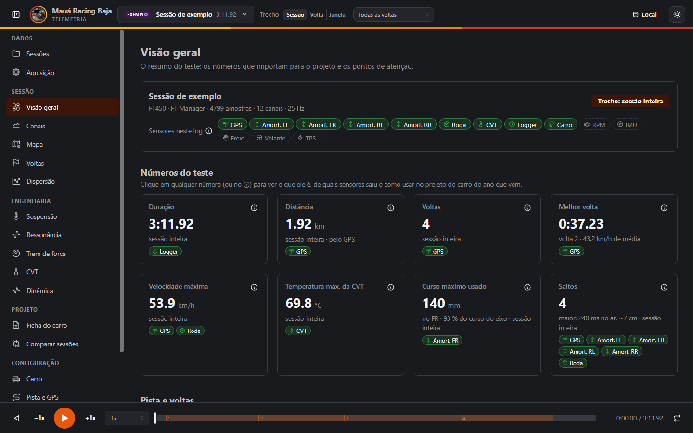

## Sumário

1. [O que o app faz](#1-o-que-o-app-faz)
2. [Primeiros passos](#2-primeiros-passos)
3. [A tela: menu, cabeçalho, Trecho e reprodução](#3-a-tela-menu-cabeçalho-trecho-e-reprodução)
4. [Abrir e enviar logs (página Sessões)](#4-abrir-e-enviar-logs-página-sessões)
5. [As páginas, uma por uma](#5-as-páginas-uma-por-uma)
6. [Cards de explicação e sensores](#6-cards-de-explicação-e-sensores)
7. [Como apresentar a aquisição aos juízes](#7-como-apresentar-a-aquisição-aos-juízes)
8. [Exemplo real: os logs de 05/10](#8-exemplo-real-os-logs-de-0510)
9. [Pista e GPS](#9-pista-e-gps)
10. [Dados do carro](#10-dados-do-carro)
11. [Testes para fazer com o carro](#11-testes-para-fazer-com-o-carro)
12. [Limites das medidas](#12-limites-das-medidas)
13. [Atalhos de teclado e mouse](#13-atalhos-de-teclado-e-mouse)

---

## 1. O que o app faz

Transforma os logs do carro — o **CSV do FT Manager** (FuelTech FT450) e o **log CAN do
BUSMASTER** — em gráficos e números que ajudam a **projetar o carro do ano que vem**:

- mapa da pista pelo GPS, colorido por qualquer canal, e voltas separadas;
- reprodução do log em tempo real (play), com gráficos, mapa e valores acompanhando;
- **suspensão:** curso usado por canto, velocidade do amortecedor, rolagem e arfagem,
  saltos e batidas no fim de curso;
- **ressonância:** frequência natural e amortecimento (teste de queda), espectro andando,
  pista × ressonância, regra de Olley;
- **trem de força:** calibração do pneu, potência na roda, largadas, coast-down (Crr e CdA);
- **CVT:** modelo térmico e projeção para o enduro;
- **dinâmica:** diagrama g-g, raio de curva, tempo por faixa de velocidade;
- **dispersão** X × Y de quaisquer canais e **fórmulas** (canais calculados pela equipe);
- **ficha do carro** com todos os números de projeto, cada um dizendo de **quais sensores**
  saiu, para exportar (CSV) ou imprimir (PDF);
- **biblioteca** para guardar, comparar e anotar os testes da temporada.

As contas são as mesmas do app antigo (`legacy/`), conferidas com um modelo físico
([seção 12](#12-limites-das-medidas)). O log é aberto e analisado **no navegador**:
funciona sem internet na pista. O servidor da equipe serve para guardar e compartilhar.

---

## 2. Primeiros passos

### O atalho no computador (jeito principal)

Dê dois cliques no atalho **Telemetria · Mauá Racing Baja** da área de trabalho (para
criar o atalho e o que fazer se algo der errado: [`NO-MEU-PC.md`](NO-MEU-PC.md)). Ele
liga o app neste computador (endereço `http://localhost:8090`) e abre uma janela própria.

- **Sem login.** Não há conta, senha, tela **Entrar** nem botão **Sair**: o app é só deste
  computador. O selo do cabeçalho mostra **Este computador**; parando o mouse em cima,
  aparece a pasta onde ficam os logs.
- **Onde ficam os logs.** Numa pasta do disco (por padrão, a pasta `data` dentro da pasta
  do app): sessões, logs enviados, perfis de carro e pista e anotações. Não dependem do
  navegador — limpar os dados do navegador não apaga nada. **Preferências → Onde ficam os
  logs** mostra o caminho (botão **Copiar**) e como fazer backup.
- **Continua de onde parou.** Abrindo o atalho de novo (ou recarregando a janela), a
  última sessão aberta reabre sozinha. **Fechar sessão** (menu da sessão no cabeçalho)
  faz ela não reabrir; para nunca reabrir, desligue **Preferências → Ao abrir o app →
  Reabrir a última sessão ao abrir o app**.
- **Backup.** Copie a pasta dos logs inteira (pen drive, outro disco, nuvem) **com o app
  fechado**, ou use **Preferências → Backup → Exportar backup** (um arquivo JSON). Um
  backup feito no navegador (endereço fixo) entra aqui por **Preferências → Importar
  backup…**: os logs vão para a pasta deste computador.
- **Equipe** fica apagada no menu: neste modo não há equipe. Para a equipe usar junto,
  cada um com a sua conta, o caminho é o servidor da equipe ([`IMPLANTACAO.md`](IMPLANTACAO.md)).

O resto do app (páginas, gráficos, cards de explicação, envio de logs) é igual nos três
jeitos.

### Os outros jeitos (alternativas)

1. Abra o endereço do app: o endereço fixo do GitHub Pages
   (`https://ricardorlfischer-ui.github.io/baja-telemetria/`, sem servidor — veja
   [Usar pelo endereço fixo](#usar-pelo-endereço-fixo-github-pages)) ou o do servidor da
   equipe (ex.: `https://telemetria.suaequipe.com.br`, ou `http://localhost:8080` no PC;
   instalação em [`IMPLANTACAO.md`](IMPLANTACAO.md)).
2. **Onde ficam as sessões.** O selo no canto direito do cabeçalho diz:
   - **Este computador** — o atalho acima (pasta do disco, sem login).
   - **Local** — só neste navegador, neste computador (somem se os dados do site forem
     apagados; veja [Usar pelo endereço fixo](#usar-pelo-endereço-fixo-github-pages)).
     Funciona sem conta e sem internet.
   - **Servidor · seu nome** — a biblioteca da equipe. Aparecendo **Servidor · entrar**,
     clique nele para abrir a tela **Entrar** (e-mail e senha). Primeira vez? Use o link
     de convite que um admin mandou, ou a aba **Criar conta com convite** e o código.
   Para ligar o servidor: **Preferências → Servidor da equipe**, cole o endereço,
   **Testar conexão** e **Conectar**.

### Os primeiros minutos (em qualquer jeito)

1. Para conhecer o app, abra a **sessão de exemplo**: botão **Dados de exemplo** na página
   **Sessões** (ou em qualquer página quando nada está aberto). Os números dela são
   conhecidos (vêm de um modelo físico) e todas as páginas funcionam.
2. Abra um log de verdade: arraste o arquivo para **Enviar logs** na página Sessões
   ([seção 4](#4-abrir-e-enviar-logs-página-sessões)).
3. Confira **Pista e GPS** e **Carro** ([seções 9](#9-pista-e-gps) e
   [10](#10-dados-do-carro)): sem isso, mapa e contas saem errados.
4. Antes de tirar conclusões, olhe **Aquisição → Qualidade**: diz se os sensores mandaram
   sinal ([seção 8](#8-exemplo-real-os-logs-de-0510) mostra por que isso importa).

**Link direto para o exemplo:** acrescentar `?exemplo=1` ao endereço abre o app já com a
sessão de exemplo, na página pedida — bom para apresentar sem procurar nada:
`https://…/?exemplo=1#/ressonancia` ou `https://…/#/canais?exemplo=1`.

Tema escuro por padrão; troque no botão de sol/lua do cabeçalho ou em **Preferências →
Tema** (Escuro, Claro ou Automático).

### Usar pelo endereço fixo (GitHub Pages)

**Endereço:** `https://ricardorlfischer-ui.github.io/baja-telemetria/` — salve nos
favoritos. É sempre o mesmo e é atualizado sozinho a cada versão nova do app. Não tem
servidor: cada integrante usa o app sozinho, e o que cada um guarda fica com ele.

**Onde ficam os logs.** Os logs que você guarda na página **Sessões** ficam **neste
navegador, neste computador** (no armazenamento do site, o IndexedDB). Nada vai para o
GitHub nem para os colegas. Voltando ao endereço no mesmo navegador do mesmo computador,
a lista de sessões está lá — e a **última sessão aberta reabre sozinha** ao recarregar a
página ou voltar outro dia. **Fechar sessão** (menu da sessão no cabeçalho) faz ela não
reabrir; para nunca reabrir, desligue **Preferências → Logs neste navegador → Reabrir a
última sessão ao abrir o app**. Outro navegador (Chrome × Edge), outro perfil do navegador
ou outro computador têm uma biblioteca própria, vazia.

**Abriu sem salvar?** Um log aberto com **Abrir arquivo sem salvar** (ou **Abrir
arquivo…** das páginas sem sessão) não fica guardado. Para guardar depois, sem abrir o
arquivo de novo: menu da sessão no cabeçalho → **Guardar na biblioteca**, ou o aviso no
topo da **Visão geral**.

**Proteção contra limpeza.** O aviso **Biblioteca local** da página Sessões e
**Preferências → Logs neste navegador** mostram o espaço usado e disponível e se os logs
estão **protegidos contra limpeza automática**. Sem proteção, o navegador pode apagar os
dados do site sozinho se o disco encher; clique em **Proteger os logs** (o Firefox
pergunta; Chrome e Edge decidem sozinhos e liberam para sites usados com frequência ou
nos favoritos). O app já pede isso ao guardar a primeira sessão. Mesmo protegidos, os
logs **somem** se você **limpar os dados do site** (ou "cookies e outros dados" do
navegador), e numa **aba anônima** nada fica guardado depois de fechar. Se acabar o
espaço, o app avisa: apague sessões antigas (exporte um backup antes, se quiser ficar com
elas).

**Backup para levar a outro computador** (ou guardar uma cópia, ou passar os logs a um
colega): **Preferências → Backup deste navegador → Exportar backup** gera um arquivo
`baja-backup-….json` com as sessões (o log inteiro), anotações, perfis de carro e pista,
configuração, fórmulas e layouts. Leve o arquivo (pendrive, Drive, e-mail) e, no outro
computador, abra o endereço → **Preferências → Importar backup…**. Sessões que já existem
lá são puladas. Faça um backup de vez em quando — é a única cópia fora deste navegador.

**A 1ª vez de cada integrante:**

1. Abra o endereço e salve nos favoritos. O selo do cabeçalho mostra **Local**; não
   precisa de conta.
2. A página Sessões aparece vazia (**Nenhuma sessão neste navegador ainda**). Para começar
   com os logs e perfis de um colega, importe o backup dele (**Preferências → Importar
   backup…**); para começar do zero, abra o **exemplo** para conhecer o app.
3. Configure **Carro** e **Pista e GPS** ([seções 9](#9-pista-e-gps) e
   [10](#10-dados-do-carro)) — os perfis também ficam neste navegador.
4. Arraste os logs para **Enviar logs** e clique em **Guardar**. Confira no aviso da
   página Sessões se os logs ficaram **protegidos contra limpeza automática**.

---

## 3. A tela: menu, cabeçalho, Trecho e reprodução

- **Menu à esquerda**, em grupos: **Dados** (Sessões, Aquisição), **Sessão** (Visão geral,
  Canais, Mapa, Voltas, Dispersão), **Engenharia** (Suspensão, Ressonância, Trem de força,
  CVT, Dinâmica), **Projeto** (Ficha do carro, Comparar sessões) e **Configuração** (Carro,
  Pista e GPS, Equipe, Preferências). Páginas que precisam de uma sessão aberta ficam
  apagadas até você abrir uma; **Equipe** só funciona com servidor. O botão no canto
  esquerdo do cabeçalho recolhe o menu (no celular ele vira um menu ☰).
- **Sessão aberta** (cabeçalho): nome, tipo (FT, CAN ou EXEMPLO) e duração. Clique para
  escolher **Sessão inteira** ou uma volta, **Guardar na biblioteca** (só para um log
  aberto sem salvar), **Trocar sessão** (vai para Sessões), **Abrir o exemplo** ou **Fechar
  sessão** (também faz o app não reabrir essa sessão ao carregar). Sem sessão aberta, o botão vira **Abrir sessão**.
- **Trecho** — **Sessão** (tudo), **Volta** (a volta escolhida no seletor ao lado) ou
  **Janela** (o que está visível nos gráficos da página Canais). O trecho vale para todas
  as páginas de análise e aparece nelas como “Trecho: …”. Na Ficha do carro, os números
  marcados como do trecho seguem a escolha; duração, voltas e teste de queda são sempre da
  sessão.
- **Barra de reprodução** (rodapé de Visão geral, Canais, Mapa e Voltas): ⏮ (início),
  −1s, ▶/❚❚, +1s, velocidade de **0,25× a 16×**, barra de tempo com as voltas numeradas
  (arraste para navegar), tempo atual / total e **repetir**. Com uma volta escolhida, o
  play fica nela.
- Toda página começa com o título e **uma frase dizendo o que ela responde para o
  projeto**; o ⓘ ao lado do título abre o card da página.

---

## 4. Abrir e enviar logs (página Sessões)

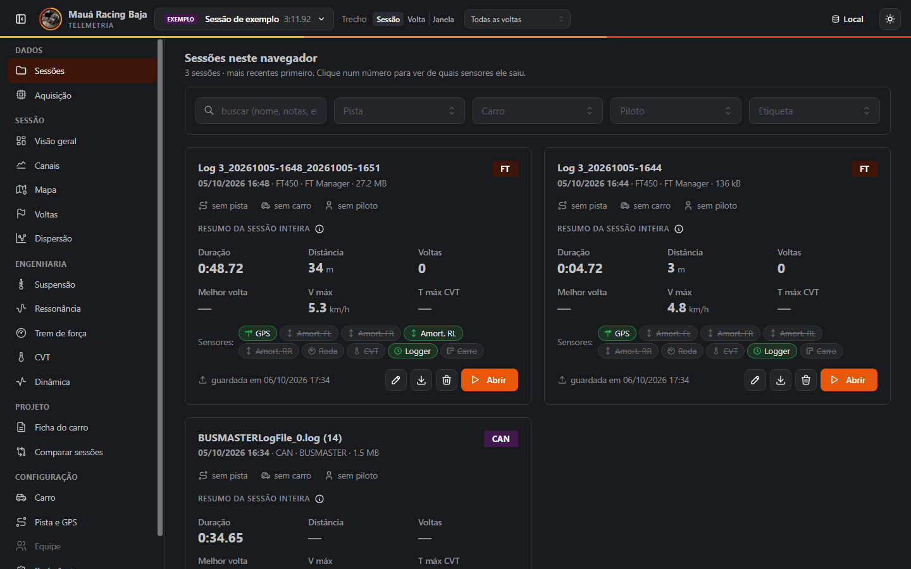

A página **Sessões** é a biblioteca. Em cima: **Dados de exemplo** e **Abrir arquivo sem
salvar** (só analisa, o arquivo não vai para a biblioteca; dá para guardar depois pelo menu
da sessão → **Guardar na biblioteca**), e o aviso do modo: **Biblioteca deste computador
— os logs ficam em …** (o atalho, com o caminho da pasta), biblioteca local (com o espaço
usado, a proteção contra limpeza e o link do backup) ou servidor da equipe.

### Enviar logs

1. Arraste um ou vários arquivos para **Enviar logs** (ou clique na área para escolher).
   Aceita o **CSV do FT Manager (FT450)** e o **log CAN do BUSMASTER** (`.txt` / `.log`).
   Cada arquivo vira uma sessão.
2. Preencha **Dados do teste** — **Piloto**, **Pista**, **Carro** (perfis), **Etiquetas**
   (ex.: `enduro`, `setup-B`, `chuva`; Enter separa) e **Notas**. Valem para todos os
   arquivos da fila.
3. Confira a **data e hora** de cada arquivo: o app tira do nome do arquivo da FT
   (`Log 3_20261005-1644.csv` → 05/10/2026 16:44) ou do cabeçalho do BUSMASTER; dá para
   corrigir na linha do arquivo.
4. Clique em **Guardar N arquivos**. O resumo (voltas, velocidade, suspensão, CVT…) é
   calculado na hora — no navegador (modo local) ou no servidor.

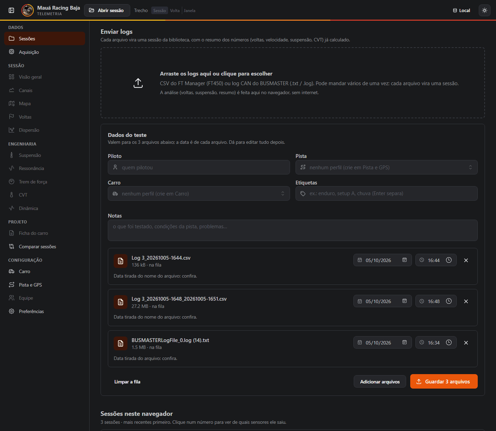

Log repetido (o mesmo arquivo já está na biblioteca) é avisado: **Abrir a que já existe**,
**Guardar mesmo assim** ou **Pular**. Deu erro? **Tentar de novo**. **Adicionar arquivos**
e **Limpar a fila** mexem na fila antes de guardar.

### A lista

Cada sessão é um cartão com data, tipo, pista, carro, piloto, o **resumo da sessão inteira**
(duração, distância, voltas, melhor volta, v máx, T máx da CVT — cada número abre o card de
explicação), os **sensores** que tinham sinal (verde) ou não (riscado) e as ações:
**Editar dados** (lápis: data, pista, carro, piloto, etiquetas, notas), **Baixar o log
original**, **Apagar** e **Abrir**. Busca e filtros por **Pista**, **Carro**, **Piloto** e
**Etiqueta** no topo da lista.

Resumo marcado **versão antiga** foi calculado com uma versão anterior das contas: use
**Recalcular o resumo** (local) ou **Pedir ao servidor para recalcular**.

No modo local, **Preferências → Backup deste navegador** exporta tudo (sessões com o log,
anotações, perfis, configuração, fórmulas, layouts) num JSON para levar a outro computador
([Usar pelo endereço fixo](#usar-pelo-endereço-fixo-github-pages)).

### Formatos

**CSV do FT Manager (FT450):** no FT Manager, abra o log baixado da FT450 e **exporte como
CSV**. A coluna de tempo e todos os canais viram gráficos; os valores `1797693…` que a FT
grava quando não há dado são ignorados. O GPS chega pelas entradas 7 e 8 do expander
([seção 9](#9-pista-e-gps)).

**Log do BUSMASTER:** o app decodifica a posição do módulo GPS (quadro `0x028`), o fix
(`0x023`), o debug do PIC (`0x7E9`) e os blocos FTCAN do expander e da FT. Útil na bancada
e para conferir o GPS (lat/lon direto, sem a conversão em código 0–255).

---

## 5. As páginas, uma por uma

| Grupo | Página | Para que serve no projeto do carro |
|---|---|---|
| Dados | **Sessões** | achar o teste certo e manter o histórico da temporada |
| Dados | **Aquisição** | saber se o log presta; decidir que sensor instalar; mostrar aos juízes |
| Sessão | **Visão geral** | o resumo do teste numa tela, para a reunião depois do treino |
| Sessão | **Canais** | achar **o que** aconteceu e **onde** (batida no fim de curso, pico de temperatura) |
| Sessão | **Mapa** | em que parte da pista cada coisa acontece |
| Sessão | **Voltas** | comparar voltas, pilotos e setups no mesmo traçado |
| Sessão | **Dispersão** | correlações entre sensores (curso × velocidade, rolagem × lateral) |
| Engenharia | **Suspensão** | curso do amortecedor novo, faixa das válvulas, barra estabilizadora |
| Engenharia | **Ressonância** | mola e amortecimento pela frequência natural e ζ |
| Engenharia | **Trem de força** | redução final, calibração da CVT, Crr e CdA para simular |
| Engenharia | **CVT** | dutos e entrada de ar para aguentar o enduro |
| Engenharia | **Dinâmica** | bitola, entre-eixos e CG; em que velocidade o carro passa o tempo |
| Projeto | **Ficha do carro** | o documento de entrada do projeto — e o que se mostra aos juízes |
| Projeto | **Comparar sessões** | provar que uma mudança (mola, pneu, CVT) melhorou |
| Configuração | **Carro** | as medidas que transformam sinal em grandeza de projeto |
| Configuração | **Pista e GPS** | mapa e voltas certos |
| Configuração | **Equipe** | (servidor) usuários, convites, papéis, minha conta |
| Configuração | **Preferências** | tema, servidor da equipe, conta, backup |

### Visão geral

O resumo do teste: sessão aberta e **Sensores neste log** (verde = com sinal, riscado =
sem sinal, tracejado = sugerido), **Números do teste** (duração, distância, voltas, melhor
volta, v máx, T máx da CVT, curso máximo usado, saltos), mapa com as voltas (clique numa
volta para ver só ela), **Pontos de atenção para o projeto**, **Qualidade dos dados**
(erros, avisos, informações), **Dados da sessão** e **Anotações**. Anotação: mova o cursor
até o instante, escreva (“bateu no fim de curso no pouso do salto”) e clique em **Anotar
neste instante** (Ctrl+Enter); clicar numa anotação leva o cursor até ela. Anotações e
dados só existem para sessões guardadas na biblioteca (o exemplo não guarda).

### Canais

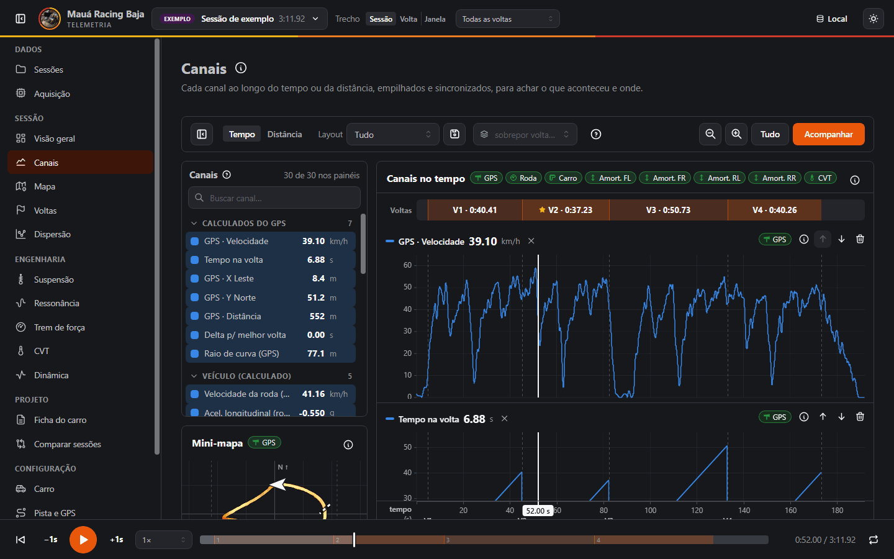

Estilo RaceStudio/MoTeC: à esquerda a **lista de canais** (calculados do GPS, veículo,
suspensão, do log e **Fórmulas**) com o valor no cursor; passando o mouse aparecem mínimo,
máximo e **ir ao ponto**. Clique num canal para mostrar/ocultar (painel novo no fim) ou
**arraste** para um painel para sobrepor. À direita, os painéis empilhados com cursor
compartilhado, a faixa de voltas no topo e o mini-mapa.

Barra de ferramentas: **Tempo / Distância** no eixo X; **Layout** (prontos: **Tudo**,
**Suspensão**, **Velocidade e GPS**, **Trem de força e CVT**, ou os que você salvar no
disquete — ficam neste navegador e abrem com qualquer sessão); **sobrepor volta…** (volta
de referência, mais clara, sob a volta escolhida); − / + zoom; **Tudo** (volta escolhida ou
sessão inteira); **Acompanhar** (no play, a janela segue o cursor).

Mouse nos gráficos: **clique/arraste = cursor · Shift+arrastar = zoom no trecho ·
Ctrl+roda = zoom · Shift+roda = andar · duplo clique = tudo**. O trecho **Janela** do
cabeçalho é exatamente o que está visível aqui.

### Mapa

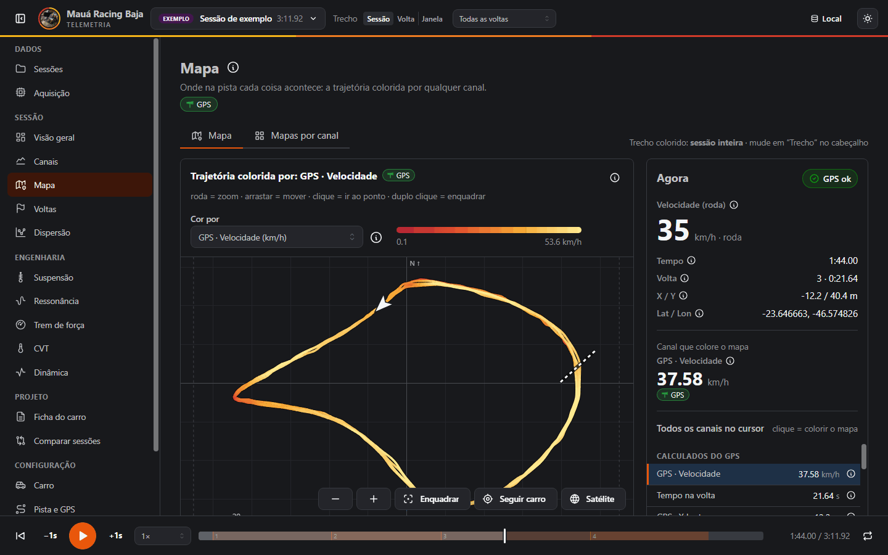

Trajetória colorida por qualquer canal (**Cor por**, com legenda), **Enquadrar**,
**Seguir carro**, **Satélite** e a **Linha de largada** (**Desenhar (2 cliques)**,
**Automática**, **Apagar**). À direita, **Agora**: velocidade, tempo, volta, X/Y, lat/lon e
todos os canais no cursor (clique num canal = colorir o mapa por ele). A aba **Mapas por
canal** mostra um mini-mapa por canal (com opção de incluir os constantes). Mouse: roda =
zoom, arrastar = mover, clique = ir ao ponto, duplo clique = enquadrar.

### Voltas

Tabela de voltas (tempo, Δ para a melhor, v máx, v média, distância; clique = trecho
dessa volta em todas as páginas), **Comparar duas voltas** (volta × volta de referência),
**velocidade ao longo da volta**, **diferença de tempo acumulada** e **onde ganhou e perdeu
tempo** em 10 trechos de mesma distância. As voltas existem com GPS e linha de largada.

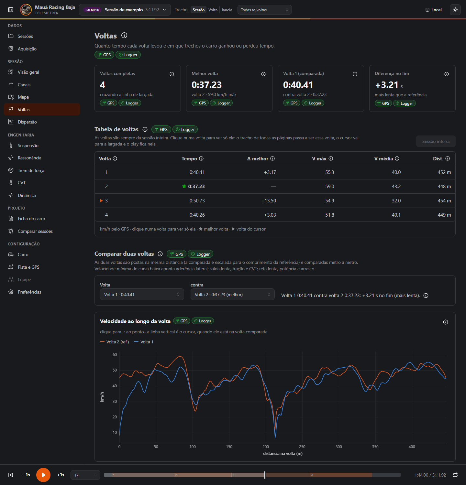

### Dispersão

X × Y de quaisquer canais. **Atalhos para o projeto** já montam os pares úteis (velocidade
do amortecedor × velocidade do carro, temperatura da CVT × velocidade, rolagem ×
aceleração lateral, curso × distância, g-g, potência × velocidade); os que este log não
permite dizem o que falta medir. Em **Canais e modo**: **Eixo X**, **Eixo Y** (⇄ troca),
**Z** opcional (cor ou média), **Pontos** ou **Mapa de calor**, valor da célula
**Contagem** ou **Média de Z**, grade de 16 a 128 células. Mostra a **correlação (r)**;
clique numa célula para ver n, média, mín, máx e desvio de cada canal e **ir ao ponto**.
Correlação não é causa: confirme com um teste controlado.

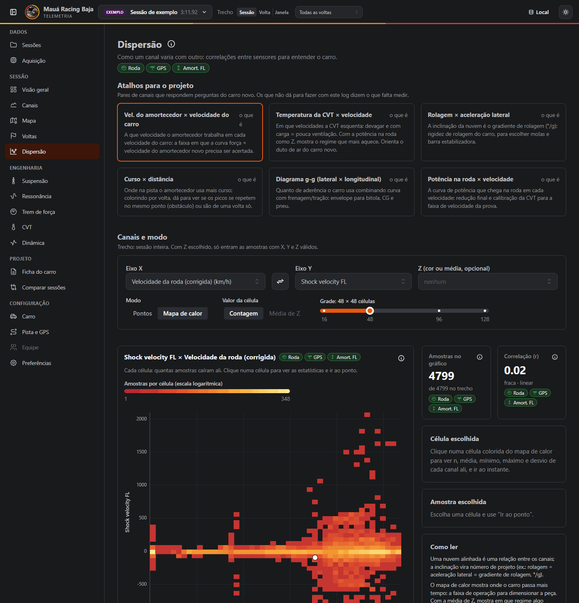

### Suspensão

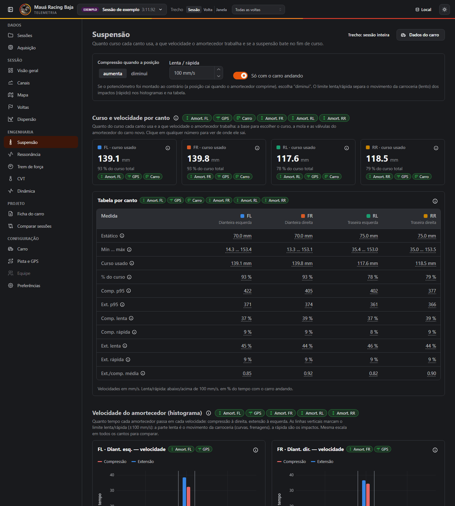

Ajustes no topo: **Compressão quando a posição aumenta / diminui** (potenciômetro montado
ao contrário), limite **Lenta / rápida** (100 mm/s) e **Só com o carro andando**. Depois:
**curso usado por canto** (e % do curso total), **tabela por canto** (estático, mín…máx,
curso, velocidades p95, % lenta/rápida), **histogramas de velocidade**, **curso em relação
ao estático**, **rolagem e arfagem** (gradientes em °/g), **saltos** e **batidas no fim de
curso** (clique = ir ao ponto). Canto sem sinal ou “quase parado” aparece marcado, com o
que conferir.

### Ressonância

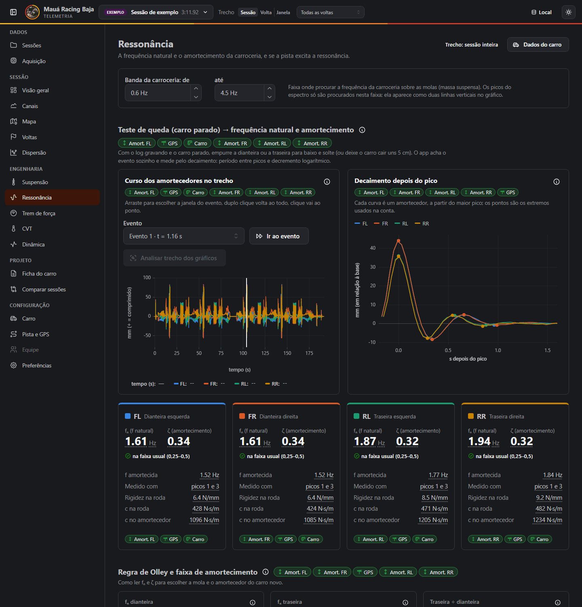

**Banda da carroceria** (onde procurar a frequência, 0,6–4,5 Hz). **Teste de queda**: o
app acha os eventos sozinho (**Evento**, **Ir ao evento**; ou arraste no gráfico e use
**Analisar trecho dos gráficos**) e mostra, por canto, **fₙ**, **ζ**, f amortecida,
rigidez e amortecimento na roda e no amortecedor. **Regra de Olley e faixa de
amortecimento** (traseira ÷ dianteira, referência 1,1–1,2), **espectro com o carro
andando** e **pista × ressonância** (ondulações da pista e as velocidades em que excitam a
carroceria).

### Trem de força

**De onde vem a velocidade** (roda corrigida pelo GPS, ou só GPS), números do trecho
(calibração da roda, v máx, potência máx na roda, força trativa, melhor 0–30 m, frenagem),
**potência na roda × velocidade**, **largadas** (0–10/20/30 m, 0–20/40 km/h,
escorregamento; clique = ir ao instante) e **coast-down** (**Usar trecho dos gráficos**,
**Ir ao trecho**, resultado Crr/CdA e **Usar estes Crr e CdA no carro**, que grava no
perfil do carro e atualiza a potência e o modelo da CVT).

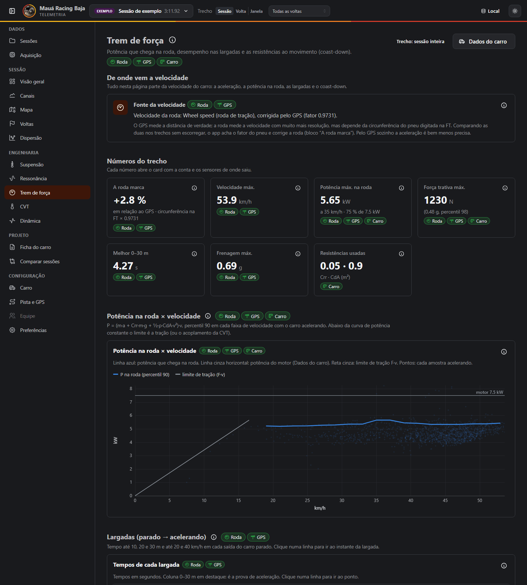

### CVT

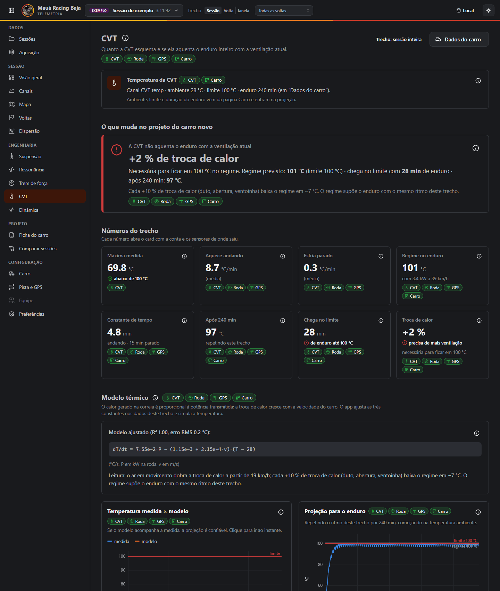

**O que muda no projeto do carro novo** em destaque (ex.: “+2 % de troca de calor”),
números (máxima, aquece andando, esfria parado, regime no enduro, constante de tempo,
chega no limite), o **modelo térmico** ajustado com a fórmula, **temperatura medida ×
modelo** e **projeção para o enduro**. Ambiente, limite e duração do enduro vêm da página
Carro.

### Dinâmica

Fonte das acelerações (roda + guinada do GPS, ou só GPS), números (v máx, média andando,
acelerações, frenagem, laterais, curva mais fechada), **diagrama g-g** e **tempo por faixa
de velocidade**.

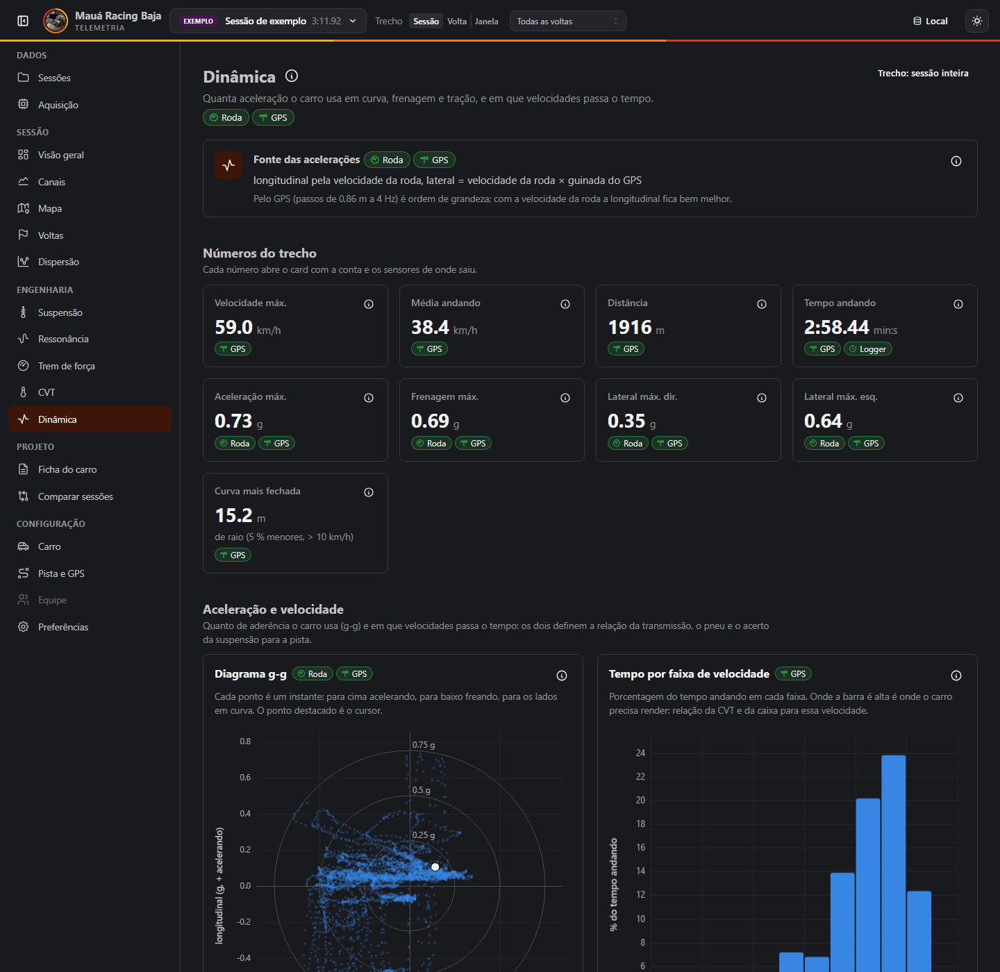

### Ficha do carro

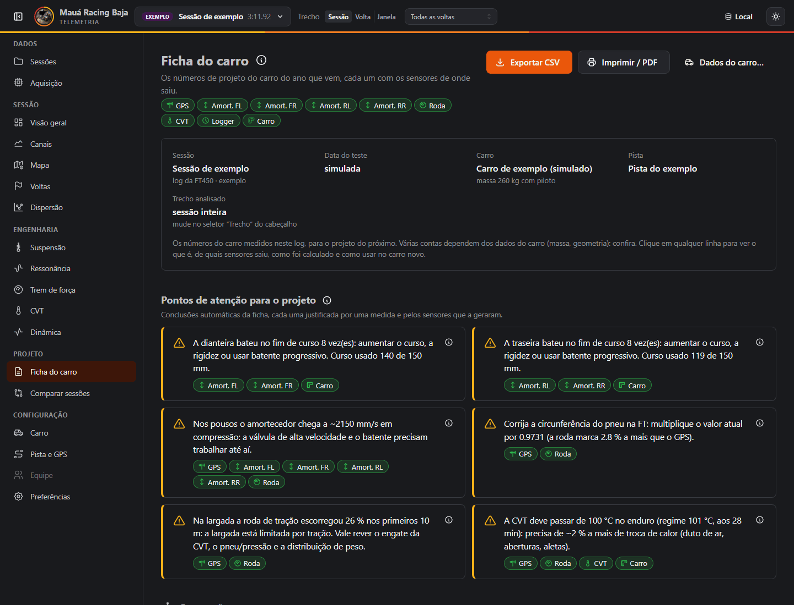

Todos os números de projeto do trecho, agrupados (Suspensão, Pista, Trem de força, CVT…),
cada linha com **Grandeza, Valor, Como foi medido, Leitura para o projeto e Sensores**, os
**Pontos de atenção para o projeto** e, no fim, **De onde saiu cada número** (a matriz de
sensores). Botões: **Exportar CSV** (com a coluna “sensores”), **Imprimir / PDF**
(impressão limpa com o cabeçalho da equipe, a coluna Sensores e a matriz) e **Dados do
carro…**. Clique em qualquer linha para abrir o card de explicação.

### Comparar sessões

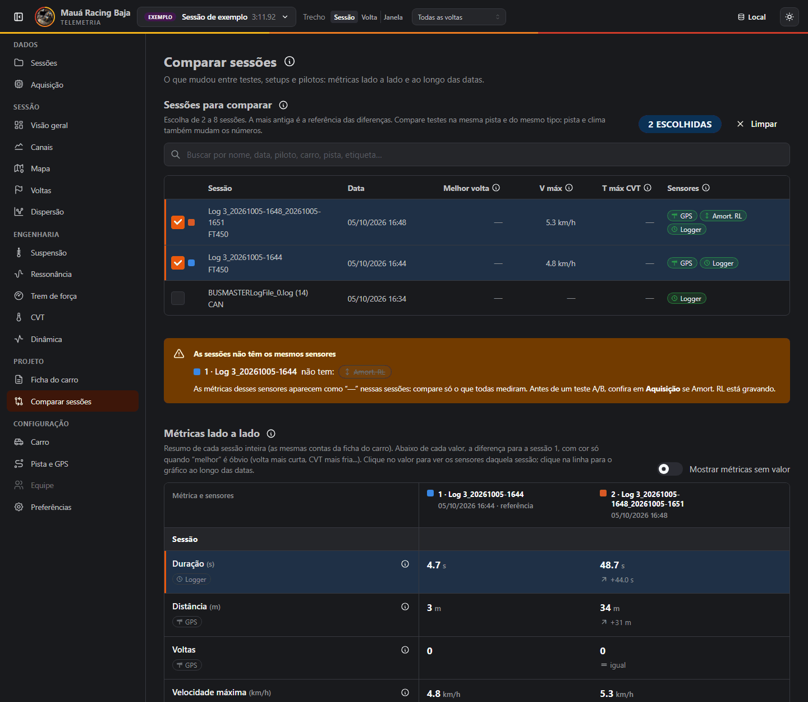

Marque de 2 a 8 sessões em **Sessões para comparar** (a mais antiga é a referência). Se as
sessões não têm os mesmos sensores, um aviso diz o quê. **Métricas lado a lado** mostra o
resumo de cada uma e, abaixo de cada valor, a diferença para a sessão 1 (com cor quando
“melhor” é óbvio, ex.: volta mais curta, CVT mais fria). Clique numa linha para ver
**Uma métrica ao longo das datas**; embaixo, **histogramas de velocidade do amortecedor
sobrepostos** e **melhor volta sobreposta**. Compare testes na mesma pista e do mesmo tipo:
pista e clima também mudam os números.

### Aquisição

Abas: **Canais do log** (cada canal com o papel detectado, sensor, taxa, mín–máx e estado;
filtros Todos / Com papel / Com problema), **Qualidade** (sensores com e sem sinal; erros,
avisos e informações, cada um com **O que fazer**), **Sensores e projeto** (a matriz para
os juízes, [seção 7](#7-como-apresentar-a-aquisição-aos-juízes)), **Fórmulas** e
**Calibração e testes** (calibração das entradas 7/8 da FT e a lista de testes com o carro,
com caixas para marcar o que já foi feito).

**Fórmulas:** um canal novo feito de outros, que aparece em Canais, Mapa e Dispersão (grupo
“Fórmulas”). **Nova fórmula** → Nome, Unidade, Expressão → **Salvar fórmula**
(Ctrl+Enter). Canais entre colchetes pela chave (`[Shock_-_Front_Left]`, `[gps:speed]`),
operadores `+ − * / ^`, comparações (dão 1 ou 0), funções `abs sqrt min max sin cos tan
atan2 exp ln log10 deriv smooth clamp if` e constantes `pi e g t` — clique nas listas para
inserir. A conta é conferida enquanto você digita. Exemplo: torção da dianteira =
`[Shock_-_Front_Left] - [Shock_-_Front_Right]`.

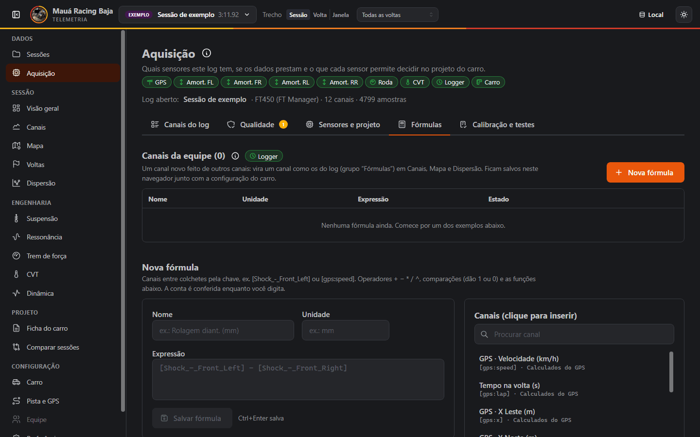

### Carro, Pista e GPS, Equipe, Preferências

- **Carro** e **Pista e GPS**: perfis (seções [9](#9-pista-e-gps) e
  [10](#10-dados-do-carro)). **Salvar como novo perfil**; escolher um perfil copia os
  números e recalcula a sessão aberta. Cada campo mostra em que contas **Entra em**.
  Com o exemplo aberto, mudanças não estragam o carro real.
- **Equipe** (servidor): **Minha conta** (**Trocar a senha**); admins veem **Usuários**
  (**Novo usuário**, papel, desativar, senha nova) e **Convites** (**Novo convite**).
  Detalhes em [`IMPLANTACAO.md`](IMPLANTACAO.md#3-primeiro-acesso-admin-convites-e-papéis).
  Pelo atalho (**Este computador**) não há equipe: a página só explica isso.
- **Preferências** pelo atalho (**Este computador**): **Tema**; **Onde ficam os logs** (o
  caminho da pasta com **Copiar**, como fazer backup e o guia `NO-MEU-PC.md`); **Ao abrir o
  app** (**Reabrir a última sessão ao abrir o app**); **Backup** (**Exportar backup**,
  **Importar backup…**, da pasta deste computador).
- **Preferências** nos outros jeitos: **Tema**; **Servidor da equipe** (**Endereço do servidor**, **Testar
  conexão**, **Conectar**, **Desconectar (usar só este navegador)**); **Conta** (**Equipe e
  trocar a senha**, **Sair**, **Entrar**); **Logs neste navegador** (espaço usado e
  disponível, **Proteger os logs**, **Reabrir a última sessão ao abrir o app**); **Backup
  deste navegador** (**Exportar backup**, **Importar backup…**).

---

## 6. Cards de explicação e sensores

**Todo número, gráfico e correlação mostra de quais sensores saiu.** Isso vale para a
equipe entender o que está vendo e para provar aos juízes que a aquisição serve ao projeto.

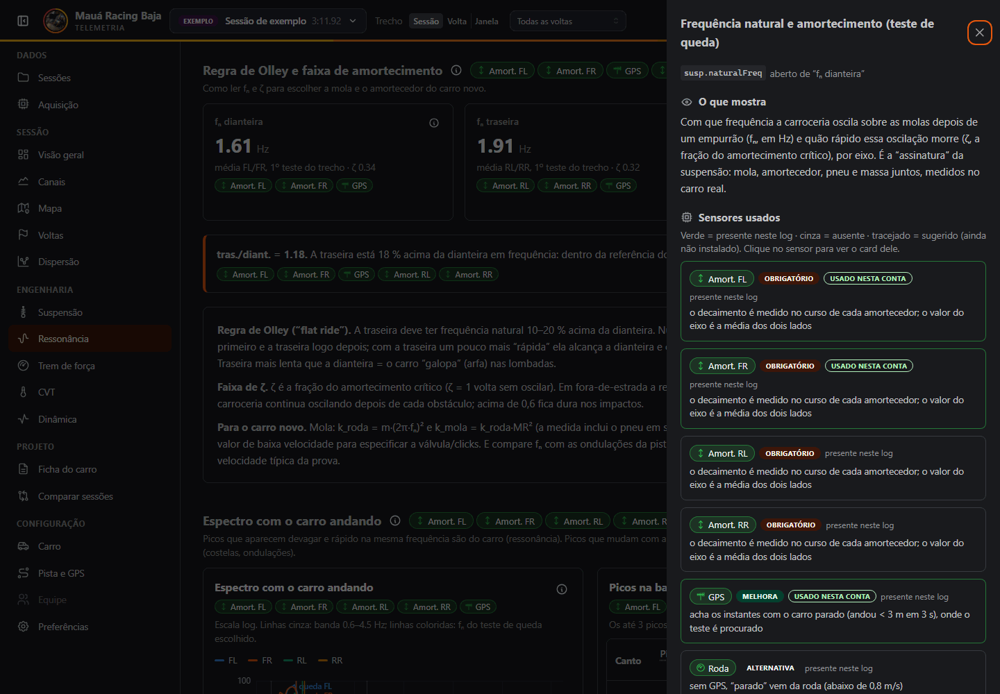

- Clique no **título** ou no **ⓘ** de qualquer gráfico, número, linha da ficha, métrica da
  comparação ou item de qualidade: abre o **card de explicação** à direita (tela cheia no
  celular). Os chips de sensor também abrem o card do sensor.
- O card tem:
  - **O que mostra**;
  - **Sensores usados** — cada sensor com o papel na conta (**obrigatório**,
    **alternativa** ou **melhora**), se está **presente neste log** e se foi **usado nesta
    conta**, e o porquê;
  - **Como é calculado** (com a fórmula);
  - **Para o carro do ano que vem** — que peça ou decisão isso dimensiona;
  - **Limitações** e **Teste para medir melhor**;
  - **Veja também** (outros cards).
- Os chips pequenos ao lado dos títulos mostram os sensores que **de fato** entraram na
  conta nesta sessão: **verde** = com sinal, **riscado** = instalado mas sem sinal,
  **tracejado** = sugerido (ainda não instalado). Ex.: a aceleração sai da roda ou, sem
  roda, do GPS.

### Sensores do carro

| Sensor | Situação | Para que serve |
|---|---|---|
| GPS (posição na pista) | instalado (PIC → expander, entradas 7/8; ou lat/lon no BUSMASTER) | trajetória, voltas, velocidade/distância sem roda, aceleração lateral, raio, calibração do pneu |
| Amortecedores FL, FR, RL, RR | instalados (potenciômetros lineares; a FT grava também a velocidade) | curso, velocidade, rolagem/arfagem, saltos, frequência natural |
| Velocidade da roda | instalado | velocidade e aceleração precisas, potência na roda, largadas, coast-down |
| Temperatura da CVT | instalado | modelo térmico e projeção do enduro |
| Datalogger (FT450) | instalado | base de tempo; a taxa limita o que dá para medir |
| Medidas do carro | digitadas na página Carro | transformam sinal em grandeza de projeto |
| Rotação do motor | **sugerido** | relação da CVT em tempo real, patinação da correia |
| IMU (acelerômetro + giroscópio) | **sugerido** | g-g e cargas de pouso medidas direto |
| Pressão de freio | **sugerido** | balanço de freio, cilindros mestres, coast-down mais limpo |
| Ângulo do volante | **sugerido** | subesterço/sobresterço, relação de direção |
| Posição do acelerador (TPS) | **sugerido** | curva de potência só com pé no fundo, onde o piloto tira o pé |

A lista completa (onde fica, como chega no log, taxa, resolução) está em **Aquisição →
Sensores e projeto**.

---

## 7. Como apresentar a aquisição aos juízes

Na prova de projeto, os juízes querem ver que **as decisões do carro novo saíram de
medidas**. Roteiro de 5–10 minutos (ensaie com a sessão de exemplo — o link
`…/?exemplo=1#/aquisicao` já abre tudo pronto — e, no dia, use um log bom da equipe):

1. **A matriz: sensores → análises → decisões.** **Aquisição → Sensores e projeto**. O
   quadro **Para os juízes: a aquisição a serviço do projeto** tem um cartão por sensor
   (**Serve para** e **Decisões do carro novo**) e a **Matriz sensor × projeto**: quantas
   análises cada sensor alimenta em cada área. Clique num número para listar só aquelas
   análises e abra uma delas. **Imprimir / PDF** na matriz para levar em papel.

   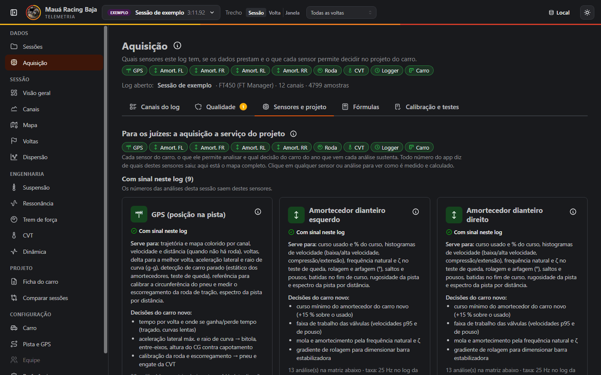

   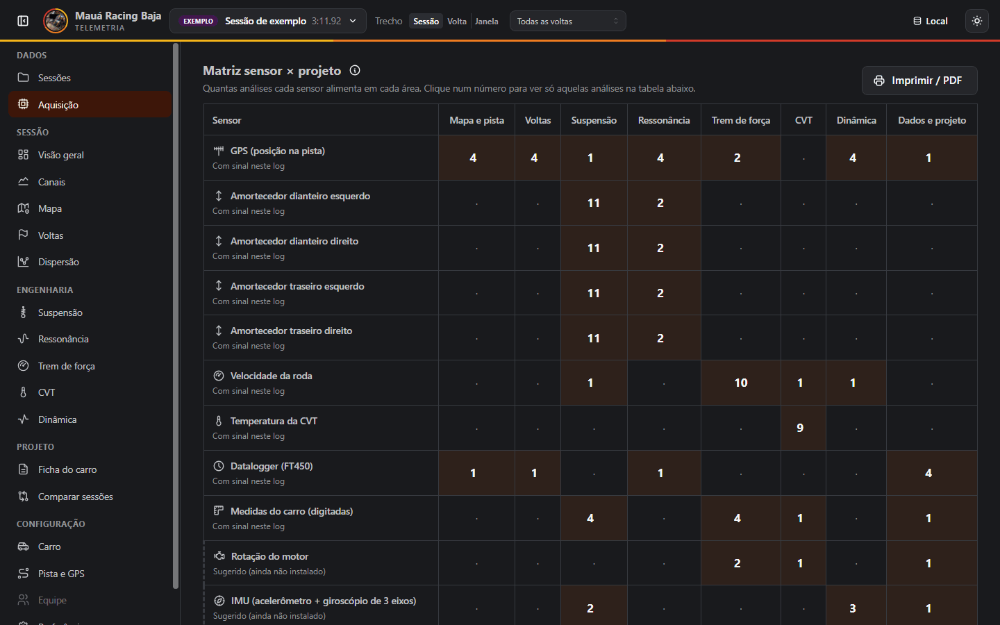

2. **A ficha do carro.** **Ficha do carro**: os números de projeto (suspensão, pista, trem
   de força, CVT), cada linha com **Como foi medido**, **Leitura para o projeto** e
   **Sensores**, mais os **Pontos de atenção para o projeto**. Leve impressa
   (**Imprimir / PDF**) e o **CSV** no pendrive.
3. **Um card de explicação, do sensor até a peça.** Escolha uma decisão forte e abra o card
   na frente do juiz. Ex.: Ressonância → **fₙ dianteira**: *O que mostra* → *Sensores
   usados* (os potenciômetros, obrigatórios, presentes neste log) → *Como é calculado*
   (decaimento no teste de queda) → *Para o carro do ano que vem* (mola e amortecedor).
   Outra boa: “o curso do amortecedor novo é X porque usamos Y mm, com Z batidas no fim de
   curso, medidos pelos potenciômetros” (Suspensão → curso usado).
4. **Comparação de sessões ou setups.** **Comparar sessões**: antes × depois de uma mudança
   (mola, clicks, pneu, duto da CVT), com a diferença de cada métrica e o gráfico ao longo
   das datas. Mostra que a equipe mede, muda e confere.
5. **O que vem no próximo ano.** Volte à aba **Sensores e projeto**, parte **Sugeridos para
   o carro novo**: rotação do motor, IMU, pressão de freio, ângulo do volante e TPS, cada
   um com o que **destravaria no projeto** (ex.: rotação + roda = relação da CVT em tempo
   real). Se couber, mostre também a aba **Qualidade** de um log com problema e o que foi
   feito ([seção 8](#8-exemplo-real-os-logs-de-0510)): conferir os dados antes de
   concluir também é engenharia.

Dica: **uma ou duas decisões contadas inteiras** convencem mais que passar por todas as
páginas. Tenha o app aberto na página da matriz e a ficha impressa na mão.

---

## 8. Exemplo real: os logs de 05/10

Os logs de 05/10/2026 mostram por que a aba **Aquisição → Qualidade** é o primeiro lugar a
olhar. Os três arquivos:

| Arquivo | O que tem |
|---|---|
| `Log 3_20261005-1644.csv` (FT450) | 4,7 s, só o GPS (entradas 7/8); andou 3 m |
| `Log 3_20261005-1648_20261005-1651.csv` (FT450) | 48,7 s a 25 Hz, GPS + 4 amortecedores; andou 34 m, v máx 5,3 km/h |
| `BUSMASTERLogFile_0.log (14).txt` (CAN) | 34,7 s a 20 Hz, 85 canais, GPS e debug do PIC |

**O que o app achou:**

- **Só o amortecedor RL tinha sinal — e mexeu ~0,2 mm.** FL, FR e RR (posição e
  velocidade) ficaram **constantes em 0** o log inteiro: o sensor não mandou sinal. O RL
  varia, mas o curso usado foi de **0,2 mm** (< 1 mm): parece só ruído — potenciômetro
  solto, travado ou mal calibrado (ou o carro quase não andou). Com isso não há curso,
  rolagem, arfagem nem frequência natural confiáveis.

  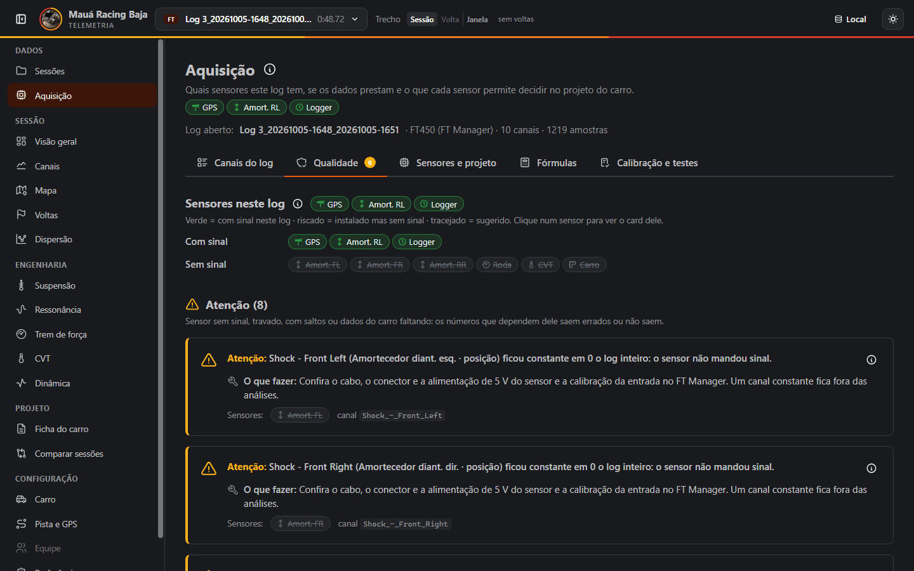

  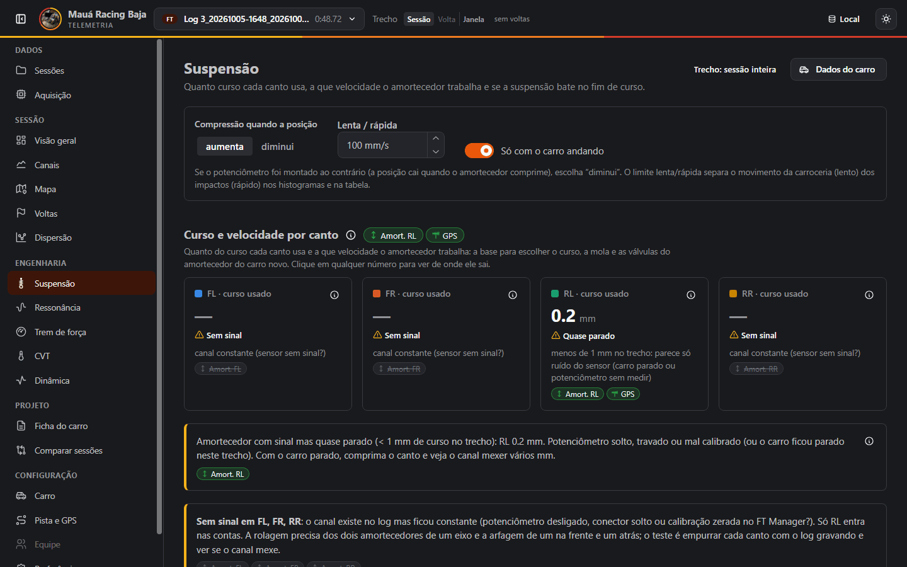

- **BUSMASTER sem fix de GPS.** O módulo mandou 128 posições, **nenhuma com fix 3D**: tipo
  de fix sempre 0, no máximo 0 satélite, status do PIC 85 (sem fix) em 94 % do tempo. Sem
  posição válida não há trajetória, mapa, voltas nem velocidade pelo GPS, e o GPS conta
  como ausente neste log.

  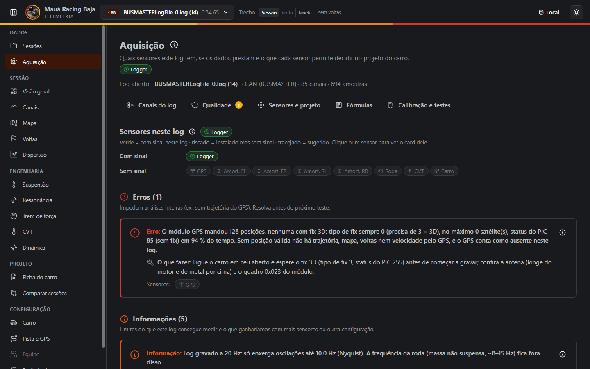

- Faltam também os **dados do carro** (relação roda/amortecedor, curso total, massa
  suspensa por roda) e os logs não têm **velocidade da roda** nem **temperatura da CVT**.

**O que fazer antes do próximo teste:**

1. **Amortecedores FL, FR, RR:** conferir cabo, conector e a alimentação de 5 V de cada
   potenciômetro e a calibração da entrada no FT Manager. Com o log gravando e o carro
   parado, comprima cada canto e veja o canal mexer vários mm (em **Canais**, layout
   **Suspensão**).
2. **Amortecedor RL:** conferir a fixação nos dois lados (corpo e haste têm que acompanhar
   o amortecedor), se o cursor não está travado e a calibração (mm por volt). Mesmo teste:
   comprimir o canto e ver o curso.
3. **GPS:** ligar o carro em céu aberto e **esperar o fix 3D** (tipo de fix 3, status do
   PIC 255) antes de começar a gravar; antena longe do motor e sem metal por cima;
   conferir o quadro `0x023` do módulo no BUSMASTER.
4. Gravar uns **5 s parado** no começo de todo log (carro no chão, piloto sentado, GPS com
   fix): é a referência do curso.
5. Preencher a página **Carro** e, se possível, gravar a roda e a temperatura da CVT.
6. Depois de consertar, repetir um log curto e conferir **Aquisição → Qualidade** sem
   avisos de sensor antes de ir para a pista.

---

## 9. Pista e GPS

### Como o GPS chega no log da FT

O PIC (`pic_gps_expander`) lê o módulo GPS no CAN e manda a posição como um **código
0–255** nas entradas **7 (X, Leste)** e **8 (Y, Norte)** do expander. No log de 05/10 elas
aparecem como:

- **X (Leste) = `Back_pressure`** (DataID `0x0177`)
- **Y (Norte) = `O2_General`** (DataID `0x0027`)

Isso vem da ordem dos DataIDs no bloco `0x2FF` do log do BUSMASTER. **Para conferir, ande
para o Norte: o Y tem que subir.** Se estiver trocado, use **Pista e GPS → Trocar X ↔ Y**.
Também dá para ligar o **Satélite** no Mapa e ver se o traçado cai em cima da pista.

Conversão (a mesma do `gps_pos.c`):

```
código = V × 51                                   (log em volts)
resolução = (tamanho + 2 × margem) / 255          200 m + 2 × 10 m → 0,863 m por passo
metros = (código − 127,5) × resolução
```

Os números da pista (**centro**, **tamanho** X/Y, **margem**) ficam em **Pista e GPS** e
**têm que ser iguais aos do `track_config.h` gravado no PIC**. Salve um perfil para cada
pista (**Salvar como novo perfil**, ex.: “Pista da faculdade”).

### Calibração na FT (entradas 7 e 8, linear 0–5 V)

Use **0,00 V = 0** e **5,00 V = 5**. Assim o log fica em volts e o app converte.

**Não use “1 V = 1”:** o PIC trava o valor no ponto mínimo da calibração (`input_value()`
em `ft_expander.c`), então tudo abaixo de 1 V (código < 51, ou seja, mais de ~66 m a
Oeste/Sul do centro) vira 1,000 e se perde. Metros direto na FT também não dá, porque esses
canais guardam 3 casas decimais em 16 bits (máx. ±32,767). O mesmo texto está em
**Aquisição → Calibração e testes**.

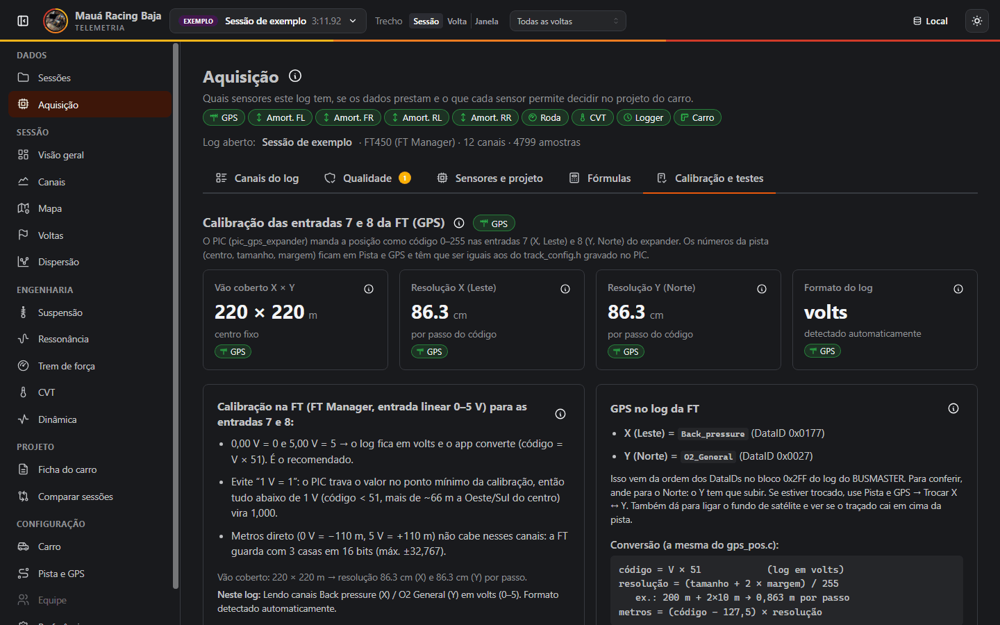

### Linha de largada e voltas

Em **Pista e GPS → Prévia e linha de largada** ou no **Mapa**: **Desenhar (2 cliques)** no
mapa ou **Automática**; **Apagar** remove. Com a linha, o app separa as voltas; escolha uma
volta no cabeçalho para ver só ela. **Volta mínima** e **Suavização da posição** ficam em
**Processamento**.

A Aquisição avisa quando o GPS fica na **borda** da área (código travado em 0 ou 255):
aumente a margem no `track_config.h`.

---

## 10. Dados do carro

A página **Carro** guarda os números que entram nas contas, em **perfis** (ex.: “BJ26 —
setup A”, “BJ26 — mola dura”). Cada grupo mostra em que contas **Entra em**; **Valores
padrão** volta ao padrão.

- **Massa e geometria:** massa total com piloto, entre-eixos, bitolas dianteira e traseira;
- **Suspensão:** relação roda/amortecedor diant./tras., curso total do amortecedor,
  massa suspensa por roda;
- **Velocidade da roda e CVT:** canal da roda e se o sensor está na **roda de tração** ou
  na **roda livre**, canal da temperatura da CVT, temperatura ambiente, limite da CVT e
  duração do enduro;
- **Resistências e motor:** Crr, CdA, densidade do ar e potência do motor (B&S 10 hp ≈
  7,5 kW);
- **Opções da análise da suspensão:** compressão quando a posição aumenta/diminui, limite
  lenta/rápida, só com o carro andando e banda da carroceria — guardadas com o perfil.

Sem esses números, curso vira só “mm do potenciômetro”, frequência não vira rigidez e
aceleração não vira potência. **Refaça as medidas quando mudar molas, massa ou geometria**
e escolha o perfil certo em cada sessão. O coast-down (Trem de força) tem o botão **Usar
estes Crr e CdA no carro**.

---

## 11. Testes para fazer com o carro

A mesma lista está em **Aquisição → Calibração e testes**, com caixas para marcar o que já
foi feito. Grave também uns **5 s parado** no começo de todo log.

1. **Teste de queda** (parado, log gravando): empurre e solte a dianteira e depois a
   traseira, umas **3 vezes cada**, com uns **5 s** entre elas (ou deixe o carro cair uns
   5 cm). O app acha os eventos sozinho e mede fₙ e ζ (Ressonância). Com a massa suspensa,
   k = m·(2π·f)² e c = 2ζ·√(k·m).
2. **Coast-down:** reta plana, embale a **~40 km/h** e deixe desacelerar **sem frear** até
   **~10 km/h** (tire o pé: a CVT desacopla, ou ponto morto). Faça **nos dois sentidos**.
   Dá Crr e CdA (Trem de força).
3. **Largadas:** **3 largadas** do carro parado de pelo menos **30 m**, em piso plano
   (0–10/20/30 m, 0–20/40 km/h, escorregamento).
4. **CVT:** um log **longo (≥ 15 min)** andando e depois **parado com o motor ligado**,
   para o modelo ver o aquecimento e o resfriamento.
5. **Medidas do carro** (página Carro): massa com piloto, massa suspensa por roda (balança
   por roda menos a massa não suspensa), relação roda/amortecedor, curso total, bitolas e
   entre-eixos.

Etiquete cada sessão com o teste (`queda`, `coast-down`, `largada`, `cvt`) para achar e
comparar depois.

---

## 12. Limites das medidas

- **Taxa de gravação:** a 25 Hz o log só enxerga até 12,5 Hz (o BUSMASTER de 05/10, a
  20 Hz, até 10 Hz). A frequência da roda (~8–15 Hz) fica fora disso. Se a FT permitir,
  grave os amortecedores mais rápido (≥ 100 Hz).
- **GPS:** com passos de 0,86 m a 4 Hz, acelerações e raios saem como **ordem de
  grandeza**; com o sensor de roda a longitudinal fica bem melhor.
- **CVT:** o modelo é de 1ª ordem. Não vê a correia patinando em baixa nem o sol direto.
- **Exemplo:** as análises foram conferidas com a sessão de exemplo, gerada por um modelo
  físico com valores conhecidos:

  | Grandeza | Real (modelo) | App |
  |---|---|---|
  | Frequência natural diant. | ~1,6 Hz | 1,61 Hz |
  | ζ diant. | 0,33 | 0,34 |
  | Erro do sensor de roda | +3 % | +2,8 % |
  | Potência na roda | 5,5 kW | 5,4–5,9 kW |
  | Força de tração | 1222 N | 1230 N |
  | Crr | 0,06 | 0,062 |
  | Coeficientes térmicos da CVT | — | erro < 15 % |
  | Ondulação | 3,2 m | 3,2 m |

Cada card de explicação traz as limitações específicas daquele número.

---

## 13. Atalhos de teclado e mouse

**Teclado** — nas páginas com a barra de reprodução (Visão geral, Canais, Mapa, Voltas) e
com uma sessão aberta. Não valem dentro de campos de texto, menus e com o card de
explicação aberto; nas outras páginas, espaço/Home/End rolam a página como sempre.

| Tecla | Ação |
|---|---|
| `Espaço` | play / pausa |
| `←` `→` | uma amostra para trás / para frente |
| `Shift` + `←` `→` | 1 s para trás / para frente |
| `Home` / `End` | começo / fim (da volta escolhida ou da sessão) |
| `Ctrl` + `Enter` | grava a anotação (Visão geral) ou a fórmula (Aquisição → Fórmulas) |

**Gráficos de canais:** clique/arraste = cursor; **Shift+arrastar** = zoom no trecho;
**Ctrl+roda** = zoom; **Shift+roda** = andar; **duplo clique** = tudo. O cursor fica
sincronizado entre os gráficos, o mapa e os valores.

**Gráficos das análises:** clique = ir ao ponto (o cursor vai para aquele instante); na
Ressonância, arrastar escolhe a janela do evento e duplo clique volta ao todo.

**Mapa:** roda do mouse / pinça = zoom; arrastar = mover; clique = ir ao ponto; duplo
clique = enquadrar.
